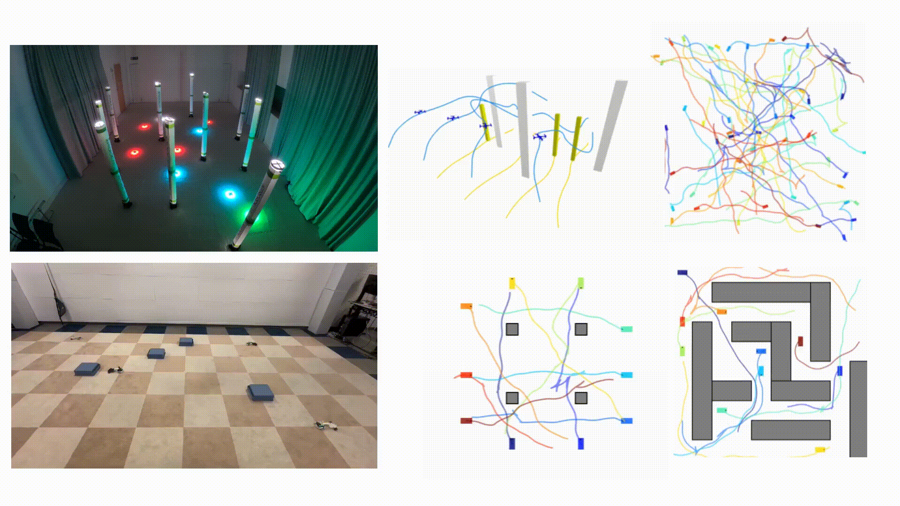

# db-lacam

We propose discontinuity-Bounded LaCAM (db-LaCAM), a planner that
utilizes a precomputed set of motion primitives that respect robot dynamics to generate horizon-length motion sequences, while allowing a user-defined discontinuity between successive motions. The planner db-LaCAM supports arbitrary robot dynamics and can handle heterogeneous team of robots. 

Resources: [Paper (PDF)](https://arxiv.org/pdf/2512.06796) | [Video](https://www.youtube.com/watch?v=K7xUFpH7a48) | [Table (PDF)](docs/table.pdf)




## Get primitives

The primitives are on the TUB cloud, download a copy, and put them inside db-lacam/

```
wget https://tubcloud.tu-berlin.de/s/wezMej9ieNjwjz6/download
unzip download
rm download
```
## Update the submodule

```
cd dynobench
git submodule update --init --recursive 
```
## Building

Tested on Ubuntu 22.04.

```
mkdir buildRelease
cd buildRelease
cmake -DCMAKE_BUILD_TYPE=Release -DCMAKE_PREFIX_PATH="/opt/openrobots/" ..
make -j
```

## Run the benchmark

```
cd buildRelease
python3 ../scripts/benchmark.py 
```

## Run the planner db-lacam

```
cd buildRelease
./db_lacam -i ../example/forest4.yaml  -o ../results/forest4.yaml --stats ../results/forest4_stats.yaml --cfg ../example/algorithms.yaml -t 30000000 
```

## License

This software is released under the MIT License, see [LICENSE.txt](LICENSE.txt).

